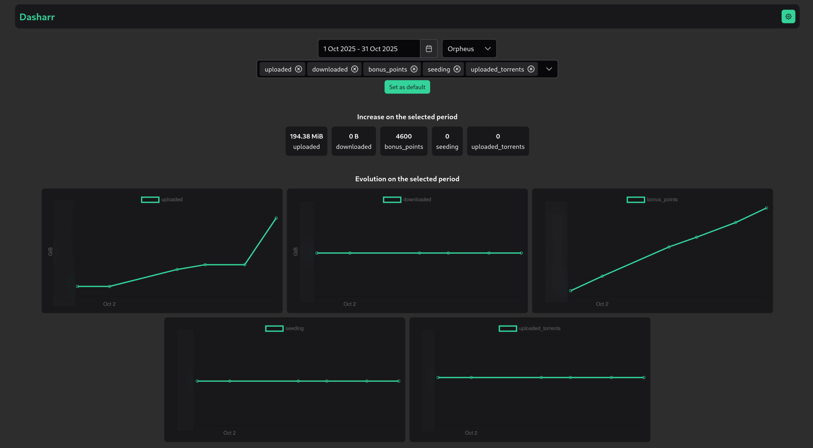

# Dasharr
Dashboard of your indexers' usage

  

## Why ?

We often times don't realize the evolution of the stats on torrent indexers, this fixes it. Also :

- see the impact of automated tools
- see the impact of new uploads
- have a clearer view of how much bounty can be spent on requests every n days
- because it's cool

## Quickstart

- Copy [compose.yml](./compose.yml)
- Create a `.env` file following [this](./backend/.env.example) one, and place it in the same folder as the compose file
- Run dasharr: `docker compose up -d` (this will run the postgres database as well)
- Visit the webui and configure the indexers that you want
- New stats will be collected for the enabled indexers every 6h

You can then visit the frontend at `http://localhost:3000` and the swagger at `http://localhost:3000/swagger-ui/#/`.

## Supported indexers

* AB
* ANT
* ATH
* BLU
* BTN
* DarkPeers
* FNP
* GGn
* HomieHelpDesk
* ITT
* LST
* MAM
* OE
* OPS
* OTW
* PhoenixProject
* R4E
* Rastastugan
* RED
* ReelFlix
* SP
* ULCX
* YOiNKED
* YUS

## Want to help ?

- Have a look at [CONTRIBUTING.md](./CONTRIBUTING.md)
- Report issues you might have, suggest new features
- Hop on the discord server and let's chat
